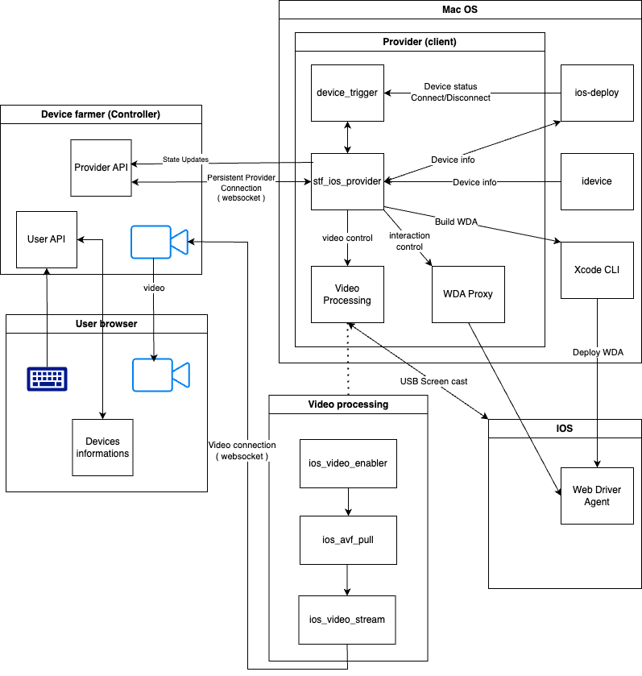

# stf_ios_support guide

## Table of Contents

- [stf\_ios\_support guide](#stf_ios_support-guide)
  - [Table of Contents](#table-of-contents)
  - [Introduction](#introduction)
  - [Installation](#installation)
  - [Architecture](#architecture)
  - [Update](#update)

## Introduction
- This project is a fork of stf-ios-provider of nanoscopic. This guide will help you to install and use this project in 2024.

## Installation

## Architecture

1. IOS app
- [WebDriverAgent](https://github.com/appium/WebDriverAgent.git) is a WebDriver server implementation for iOS that can be used to remote control iOS devices. It allows you to launch & kill applications, tap & scroll views or confirm view presence on a screen. Expose api to control the device.

2. iPhone screen mirroring
    - [ios-avf-enabler](https://github.com/nanoscopic/ios_video_enabler.git) enable screen mirroring with AVFoundation
    - [ios-avf-pull](https://github.com/nanoscopic/ios_avf_pull.git) pull frame from AVFoundation and send to nanomsg socket
    - [ios-video-stream](https://github.com/BastienTLC/ios_video_stream.git) read frame into nanomsg socket and create video stream server

3. Device control
    - [ideviceinfo](https://github.com/libimobiledevice/libimobiledevice.git) cross-platform software library that talks the protocols to interact with iOS devices
    - [ios-deploy](https://github.com/nanoscopic/ios-deploy.git) install and debug iOS apps from the command-line
    - [WdaProxy](https://github.com/nanoscopic/wdaproxy.git) proxy to control WebDriverAgent
    - [device-trigger](https://github.com/tmobile/osx_ios_device_trigger.git) ios usb device attach/detach event trigger

4. STF provider
    - [stf_ios_provider](https://github.com/BastienTLC/stf-ios-provider.git) catch controller output and use all previous modules to control the device and response mobile data

## Update 

1. STF Support 
   - Fixing some library paths. The paths are hardcoded in stf-ios-provider and by default, they are located in /usr/local. I changed them to /opt/homebrew.
   - Deactivate blocking code: [link to issue](https://github.com/dryark/stf_ios_support/issues/108).
   - Adapt screen casting socket for RDT.
   - Change git repository in makefile to use my fork.
 
2. STF Provider 
    - fix wda api, update touch and swip, use actions instead of perform

3. IOS Video Stream
    - modify video server endpoint to fit with RDT

